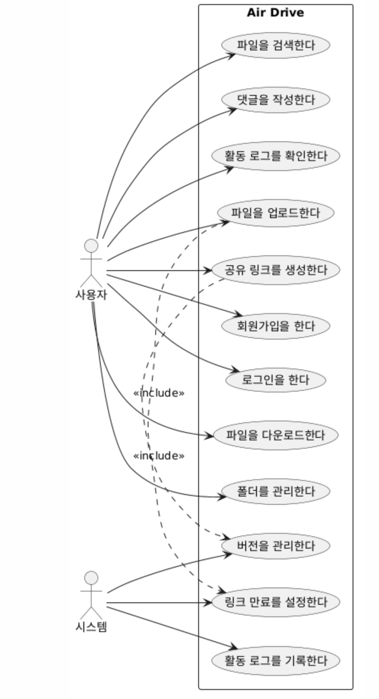
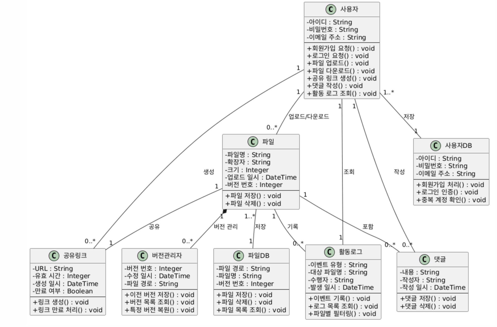

# 에어 드라이브 (Air Drive) 요구사항 분석서

> **프로젝트명**: 경량화된 팀 협업을 위한 분산 파일 관리 및 히스토리 추적 시스템 구축  
> **시스템명**: 에어 드라이브 (Air Drive)  
> **팀 원**: 김채윤  
> **문서번호**: `[AirDrive]_요구사항분석서_260507_Doc-001`

---

## 제/개정 이력

| 버전 | 날짜 | 작성자 | 제/개정사항 | 비고 |
|:---:|:---:|:---:|:---|:---:|
| 1.0 | 2026-05-07 | 김채윤 | 최초 작성 | 최종본 |

---

## 목차

1. [서론](#1-서론)
   - 1.1 [목적 및 범위](#11-목적-및-범위)
   - 1.2 [용어 정의](#12-용어-정의)
   - 1.3 [참조 문서](#13-참조-문서)
2. [시스템 개요](#2-시스템-개요)
   - 2.1 [소프트웨어 컨텍스트](#21-소프트웨어-컨텍스트)
   - 2.2 [기능 분류 및 설명](#22-기능-분류-및-설명)
3. [요구사항 명세](#3-요구사항-명세)
   - 3.1 [정적 분석 (클래스 다이어그램)](#31-정적-분석-클래스-다이어그램)
   - 3.2 [CRC 카드](#32-crc-카드)
   - 3.3 [동적 분석 (순차 다이어그램)](#33-동적-분석-순차-다이어그램)
4. [인터페이스 분석](#4-인터페이스-분석)
5. [제약사항](#5-제약사항)
6. [요구사항 추적표](#6-요구사항-추적표)
7. [참고문헌 및 부록](#7-참고문헌-및-부록)

---

## 1. 서론

### 1.1 목적 및 범위

이 문서는 **에어 드라이브(Air Drive)** — 경량화된 팀 협업을 위한 분산 파일 관리 및 히스토리 추적 시스템 — 의 요구사항을 기능 관점, 구조 관점, 행위 관점에서 분석한 문서이다. 유스케이스 다이어그램, 클래스 다이어그램, 순차 다이어그램을 통해 시스템의 요구사항을 구체화한다.

### 1.2 용어 정의

| 용어 | 설명 |
|:---|:---|
| 버전 제어 | 파일의 변경 이력을 관리하고, 이전 상태로 복원할 수 있는 기능 |
| 시간 제한부 링크 | 일정 시간이 지나면 자동으로 만료되는 임시 공유 URL |
| 활동 로그 | 파일의 업로드, 수정, 다운로드 등 사용자 행동 기록 |
| 드래그 앤 드롭 | 마우스로 파일을 끌어다 놓는 방식의 UI 인터랙션 |
| API | 응용 프로그램에서 사용할 수 있도록 운영체제나 프로그래밍 언어가 제공하는 기능을 제어할 수 있게 만든 인터페이스 |

### 1.3 참조 문서

1. `[AirDrive]_프로젝트관리계획서_260426_Doc-001.md`
2. `[AirDrive]_요구사항정의서_260430_Doc-001.md`

---

## 2. 시스템 개요

### 2.1 소프트웨어 컨텍스트

#### 2.1.1 Actor Table

| Actor | Role |
|:---|:---|
| 사용자 | 파일 업로드/다운로드, 공유 링크 생성, 댓글 작성, 검색, 활동 로그 확인 등 시스템을 직접 사용하는 주체 |
| 시스템 | 사용자 인증, 파일 저장, 버전 관리, 링크 만료 처리, 활동 로그 기록 등을 자동으로 수행하는 주체 |

#### 2.1.2 UseCase Diagram



> 이미지 파일을 `images/usecase_diagram.png` 경로에 저장 후 업로드하세요.

---

### 2.2 기능 분류 및 설명

#### 2.2.1 UseCase Description

---

**Use Case Name : 회원가입을 한다. | ID : U_01 | Importance Level: High**

| 항목 | 내용 |
|:---|:---|
| Primary Actor | 사용자 |
| Use Case Type | Detail, essential |
| Brief Description | 이 Use-Case는 사용자가 회원가입을 하는 Use Case를 표현한다. |
| Trigger | 사용자는 회원가입 버튼을 누른다. |
| Association | 사용자 |
| Include | - |
| Extend | - |
| Generalization | - |

**Normal Flow of Events**
1. 사용자는 아이디, 비밀번호, 이메일 주소를 입력한다.
2. 사용자는 회원가입 버튼을 누른다.
3. 시스템은 회원가입이 성공한 경우 메인 화면으로 이동한다.

**Alternate / Exceptional Flows**
- 2.a1 : 공란이 있을 경우 시스템은 실패 이유를 화면에 출력한다.
- 2.a2 : 동일한 아이디 또는 이메일이 있을 경우 시스템은 실패 이유를 화면에 출력한다.

---

**Use Case Name : 로그인을 한다. | ID : U_02 | Importance Level: High**

| 항목 | 내용 |
|:---|:---|
| Primary Actor | 사용자 |
| Use Case Type | Detail, essential |
| Brief Description | 이 Use-Case는 사용자가 로그인을 하는 Use Case를 표현한다. |
| Trigger | 사용자는 로그인 버튼을 누른다. |
| Association | 사용자 |
| Include | - |
| Extend | - |
| Generalization | - |

**Normal Flow of Events**
1. 사용자는 아이디, 비밀번호를 입력한다.
2. 사용자는 로그인 버튼을 누른다.
3-1. 로그인이 성공한 경우 → S-1
3-2. 로그인이 실패한 경우 → S-2

**Subflows**
- S-1 : 시스템은 메인 화면으로 이동한다.
- S-2 : 시스템은 로그인 실패 이유를 화면에 출력한다.

**Alternate / Exceptional Flows**
- 없음

---

**Use Case Name : 파일을 업로드한다. | ID : U_03 | Importance Level: High**

| 항목 | 내용 |
|:---|:---|
| Primary Actor | 사용자 |
| Use Case Type | Detail, essential |
| Brief Description | 이 Use-Case는 사용자가 파일을 업로드하는 Use Case를 표현한다. |
| Trigger | 사용자는 파일을 드래그 앤 드롭하거나 업로드 버튼을 누른다. |
| Association | 사용자 |
| Include | 버전을 관리한다. |
| Extend | - |
| Generalization | - |

**Normal Flow of Events**
1. 사용자는 파일을 드래그 앤 드롭하거나 선택한다.
2. 시스템은 파일을 저장소에 저장한다.
3. 시스템은 활동 로그에 업로드 이벤트를 기록한다.
4. 동일 파일명이 존재할 경우 기존 파일을 이전 버전으로 처리한다.

**Alternate / Exceptional Flows**
- 2.a1 : 파일 크기 초과 시 시스템은 업로드 실패 이유를 화면에 출력한다.

---

**Use Case Name : 파일을 다운로드한다. | ID : U_04 | Importance Level: High**

| 항목 | 내용 |
|:---|:---|
| Primary Actor | 사용자 |
| Use Case Type | Detail, essential |
| Brief Description | 이 Use-Case는 사용자가 파일을 다운로드하는 Use Case를 표현한다. |
| Trigger | 사용자는 다운로드 버튼을 누른다. |
| Association | 사용자 |
| Include | - |
| Extend | - |
| Generalization | - |

**Normal Flow of Events**
1. 사용자는 다운로드할 파일을 선택한다.
2. 사용자는 다운로드 버튼을 누른다.
3. 시스템은 파일을 사용자 기기에 저장한다.
4. 시스템은 활동 로그에 다운로드 이벤트를 기록한다.

**Alternate / Exceptional Flows**
- 없음

---

**Use Case Name : 폴더를 관리한다. | ID : U_05 | Importance Level: High**

| 항목 | 내용 |
|:---|:---|
| Primary Actor | 사용자 |
| Use Case Type | Detail, essential |
| Brief Description | 이 Use-Case는 사용자가 폴더를 생성하고 파일을 분류하는 Use Case를 표현한다. |
| Trigger | 사용자는 폴더 생성 버튼을 누른다. |
| Association | 사용자 |
| Include | - |
| Extend | - |
| Generalization | - |

**Normal Flow of Events**
1. 사용자는 폴더 이름을 입력하고 생성한다.
2. 사용자는 파일을 원하는 폴더로 이동한다.

**Alternate / Exceptional Flows**
- 1.a1 : 동일한 폴더명이 있을 경우 시스템은 경고 메시지를 출력한다.

---

**Use Case Name : 공유 링크를 생성한다. | ID : U_06 | Importance Level: High**

| 항목 | 내용 |
|:---|:---|
| Primary Actor | 사용자 |
| Use Case Type | Detail, essential |
| Brief Description | 이 Use-Case는 사용자가 파일에 대한 시간 제한부 공유 링크를 생성하는 Use Case를 표현한다. |
| Trigger | 사용자는 공유 링크 생성 버튼을 누른다. |
| Association | 사용자 |
| Include | 링크 만료를 설정한다. |
| Extend | - |
| Generalization | - |

**Normal Flow of Events**
1. 사용자는 공유할 파일을 선택한다.
2. 사용자는 링크 유효 시간을 설정한다. (1시간, 24시간 등)
3. 시스템은 임시 공유 URL을 생성한다.
4. 설정된 시간 경과 후 시스템은 링크를 자동 만료시킨다.

**Alternate / Exceptional Flows**
- 없음

---

**Use Case Name : 파일을 검색한다. | ID : U_07 | Importance Level: High**

| 항목 | 내용 |
|:---|:---|
| Primary Actor | 사용자 |
| Use Case Type | Detail, essential |
| Brief Description | 이 Use-Case는 사용자가 키워드로 파일을 검색하는 Use Case를 표현한다. |
| Trigger | 사용자는 검색창에 키워드를 입력한다. |
| Association | 사용자 |
| Include | - |
| Extend | - |
| Generalization | - |

**Normal Flow of Events**
1. 사용자는 파일명, 확장자, 태그 등 키워드를 입력한다.
2. 시스템은 실시간으로 검색 결과를 필터링하여 표시한다.

**Alternate / Exceptional Flows**
- 2.a1 : 검색 결과가 없을 경우 시스템은 결과 없음 메시지를 출력한다.

---

**Use Case Name : 댓글을 작성한다. | ID : U_08 | Importance Level: Medium**

| 항목 | 내용 |
|:---|:---|
| Primary Actor | 사용자 |
| Use Case Type | Detail, essential |
| Brief Description | 이 Use-Case는 사용자가 파일에 댓글을 작성하는 Use Case를 표현한다. |
| Trigger | 사용자는 댓글 입력창에 내용을 입력하고 등록 버튼을 누른다. |
| Association | 사용자 |
| Include | - |
| Extend | - |
| Generalization | - |

**Normal Flow of Events**
1. 사용자는 댓글을 작성할 파일을 선택한다.
2. 사용자는 댓글 내용을 입력하고 등록한다.
3. 시스템은 작성자, 작성 시간과 함께 댓글을 저장한다.

**Alternate / Exceptional Flows**
- 2.a1 : 내용이 공란일 경우 시스템은 등록을 차단한다.

---

**Use Case Name : 활동 로그를 확인한다. | ID : U_09 | Importance Level: Medium**

| 항목 | 내용 |
|:---|:---|
| Primary Actor | 사용자 |
| Use Case Type | Detail, essential |
| Brief Description | 이 Use-Case는 사용자가 팀의 활동 로그를 확인하는 Use Case를 표현한다. |
| Trigger | 사용자는 활동 로그 메뉴를 선택한다. |
| Association | 사용자 |
| Include | - |
| Extend | - |
| Generalization | - |

**Normal Flow of Events**
1. 사용자는 활동 로그 메뉴를 선택한다.
2. 시스템은 업로드, 수정, 다운로드 이벤트를 시간순으로 표시한다.
3. 사용자는 특정 파일로 필터링하여 확인할 수 있다.

**Alternate / Exceptional Flows**
- 없음

---

## 3. 요구사항 명세

### 3.1 정적 분석 (클래스 다이어그램)



> 이미지 파일을 `images/class_diagram.png` 경로에 저장 후 업로드하세요.

---

### 3.2 CRC 카드

---

**Class Name: 사용자 (User) | ID: 01 | Type: Concrete, Domain**

| 항목 | 내용 |
|:---|:---|
| Description | Air Drive 시스템을 사용하는 주체를 나타낸다. |
| Associated Use Case | U_01, U_02, U_03, U_04, U_05, U_06, U_07, U_08, U_09 |

| Responsibilities (책임) | Collaborators (협력자) |
|:---|:---|
| 회원가입 요청 | 사용자 DB |
| 로그인 요청 | 사용자 DB |
| 파일 업로드/다운로드 요청 | 파일 |
| 공유 링크 생성 요청 | 공유 링크 |
| 댓글 작성 | 댓글 |
| 활동 로그 조회 | 활동 로그 |

| Attributes | |
|:---|:---|
| 아이디 | String |
| 비밀번호 | String |
| 이메일 주소 | String |

| Relationships | |
|:---|:---|
| Generalization (a-kind-of) | - |
| Aggregation (has-parts) | - |
| Other Associations | 파일, 댓글, 공유 링크, 활동 로그 |

---

**Class Name: 파일 (File) | ID: 02 | Type: Concrete, Domain**

| 항목 | 내용 |
|:---|:---|
| Description | 사용자가 업로드한 파일을 나타낸다. |
| Associated Use Case | U_03, U_04, U_05 |

| Responsibilities (책임) | Collaborators (협력자) |
|:---|:---|
| 파일 메타데이터 관리 | 파일 DB |
| 버전 이력 관리 | 버전 관리자 |
| 폴더 분류 | 폴더 |

| Attributes | |
|:---|:---|
| 파일명 | String |
| 확장자 | String |
| 크기 | Integer |
| 업로드 일시 | DateTime |
| 버전 번호 | Integer |

| Relationships | |
|:---|:---|
| Generalization (a-kind-of) | - |
| Aggregation (has-parts) | 버전 관리자 |
| Other Associations | 사용자, 댓글, 활동 로그 |

---

**Class Name: 버전 관리자 (VersionManager) | ID: 03 | Type: Concrete, Domain**

| 항목 | 내용 |
|:---|:---|
| Description | 파일의 버전 이력을 관리하는 클래스를 나타낸다. |
| Associated Use Case | U_03 |

| Responsibilities (책임) | Collaborators (협력자) |
|:---|:---|
| 이전 버전 저장 | 파일 DB |
| 버전 목록 조회 | 사용자 |
| 특정 버전 복원 | 파일 |

| Attributes | |
|:---|:---|
| 버전 번호 | Integer |
| 수정 일시 | DateTime |
| 파일 경로 | String |

| Relationships | |
|:---|:---|
| Generalization (a-kind-of) | - |
| Aggregation (has-parts) | - |
| Other Associations | 파일 |

---

**Class Name: 공유 링크 (ShareLink) | ID: 04 | Type: Concrete, Domain**

| 항목 | 내용 |
|:---|:---|
| Description | 시간 제한부 파일 공유 링크를 나타낸다. |
| Associated Use Case | U_06 |

| Responsibilities (책임) | Collaborators (협력자) |
|:---|:---|
| 공유 URL 생성 | 파일 |
| 만료 여부 판단 | 시스템 |
| 링크 만료 처리 | 시스템 |

| Attributes | |
|:---|:---|
| URL | String |
| 유효 시간 | Integer |
| 생성 일시 | DateTime |
| 만료 여부 | Boolean |

| Relationships | |
|:---|:---|
| Generalization (a-kind-of) | - |
| Aggregation (has-parts) | - |
| Other Associations | 파일, 사용자 |

---

**Class Name: 댓글 (Comment) | ID: 05 | Type: Concrete, Domain**

| 항목 | 내용 |
|:---|:---|
| Description | 파일에 작성된 댓글을 나타낸다. |
| Associated Use Case | U_08 |

| Responsibilities (책임) | Collaborators (협력자) |
|:---|:---|
| 댓글 저장 | 댓글 DB |
| 작성자 및 시간 기록 | 사용자 |

| Attributes | |
|:---|:---|
| 내용 | String |
| 작성자 | String |
| 작성 일시 | DateTime |

| Relationships | |
|:---|:---|
| Generalization (a-kind-of) | - |
| Aggregation (has-parts) | - |
| Other Associations | 파일, 사용자 |

---

**Class Name: 활동 로그 (ActivityLog) | ID: 06 | Type: Concrete, Domain**

| 항목 | 내용 |
|:---|:---|
| Description | 파일의 업로드, 수정, 다운로드 이벤트를 기록하는 클래스를 나타낸다. |
| Associated Use Case | U_03, U_04, U_09 |

| Responsibilities (책임) | Collaborators (협력자) |
|:---|:---|
| 이벤트 기록 | 시스템 |
| 로그 목록 조회 | 사용자 |
| 파일별 로그 필터링 | 사용자 |

| Attributes | |
|:---|:---|
| 이벤트 유형 | String |
| 대상 파일명 | String |
| 수행자 | String |
| 발생 일시 | DateTime |

| Relationships | |
|:---|:---|
| Generalization (a-kind-of) | - |
| Aggregation (has-parts) | - |
| Other Associations | 파일, 사용자 |

---

**Class Name: 파일 DB | ID: 07 | Type: Concrete, Domain**

| 항목 | 내용 |
|:---|:---|
| Description | 파일 및 버전 정보를 저장하는 DB를 나타낸다. |
| Associated Use Case | U_03, U_04 |

| Responsibilities (책임) | Collaborators (협력자) |
|:---|:---|
| 파일 저장 | 파일 |
| 파일 삭제 | 사용자 |
| 파일 목록 조회 | 사용자 |
| 버전 이력 저장 | 버전 관리자 |

| Attributes | |
|:---|:---|
| 파일 경로 | String |
| 파일명 | String |
| 버전 번호 | Integer |

| Relationships | |
|:---|:---|
| Generalization (a-kind-of) | 파일 |
| Aggregation (has-parts) | - |
| Other Associations | 버전 관리자 |

---

**Class Name: 사용자 DB | ID: 08 | Type: Concrete, Domain**

| 항목 | 내용 |
|:---|:---|
| Description | 사용자 계정 정보를 저장하는 DB를 나타낸다. |
| Associated Use Case | U_01, U_02 |

| Responsibilities (책임) | Collaborators (협력자) |
|:---|:---|
| 회원가입 처리 | 사용자 |
| 로그인 인증 | 사용자 |
| 중복 계정 확인 | 사용자 |

| Attributes | |
|:---|:---|
| 아이디 | String |
| 비밀번호 | String |
| 이메일 주소 | String |

| Relationships | |
|:---|:---|
| Generalization (a-kind-of) | 사용자 |
| Aggregation (has-parts) | - |
| Other Associations | - |

---

### 3.3 동적 분석 (순차 다이어그램)

#### 3.3.1 회원가입을 한다.


> PlantUML 코드:
> ```plantuml
> @startuml
> actor 사용자
> participant ":사용자 DB" as DB
> 
> 사용자 -> DB : 회원가입 요청(아이디, 비밀번호, 이메일)
> alt [가입 성공]
>     DB --> 사용자 : success
> else [공란 있음]
>     DB --> 사용자 : fail (공란 오류)
> else [중복 있음]
>     DB --> 사용자 : fail (중복 오류)
> end
> @enduml
> ```

---

#### 3.3.2 로그인을 한다.


> PlantUML 코드:
> ```plantuml
> @startuml
> actor 사용자
> participant ":사용자 DB" as DB
> 
> 사용자 -> DB : 로그인 요청(아이디, 비밀번호)
> alt [로그인 성공]
>     DB --> 사용자 : success
> else [로그인 실패]
>     DB --> 사용자 : fail (오류 메시지 출력)
> end
> @enduml
> ```

---

#### 3.3.3 파일을 업로드한다.


> PlantUML 코드:
> ```plantuml
> @startuml
> actor 사용자
> participant ":파일" as File
> participant ":파일 DB" as DB
> participant ":버전 관리자" as VM
> participant ":활동 로그" as Log
> 
> 사용자 -> File : 파일 업로드()
> File -> DB : 파일 저장()
> alt [동일 파일명 존재]
>     DB -> VM : 이전 버전 저장()
>     VM --> DB : success
> end
> DB -> Log : 업로드 이벤트 기록()
> DB --> File : success
> File --> 사용자 : success
> @enduml
> ```

---

#### 3.3.4 파일을 다운로드한다.


> PlantUML 코드:
> ```plantuml
> @startuml
> actor 사용자
> participant ":파일" as File
> participant ":파일 DB" as DB
> participant ":활동 로그" as Log
> 
> 사용자 -> File : 파일 다운로드()
> File -> DB : 파일 불러오기()
> DB --> File : success
> File -> Log : 다운로드 이벤트 기록()
> File --> 사용자 : success
> @enduml
> ```

---

#### 3.3.5 공유 링크를 생성한다.


> PlantUML 코드:
> ```plantuml
> @startuml
> actor 사용자
> participant ":공유 링크" as Link
> participant ":파일" as File
> participant ":시스템" as System
> 
> 사용자 -> Link : 공유 링크 생성(유효 시간)
> Link -> File : 파일 확인()
> File --> Link : success
> Link -> System : 링크 만료 설정()
> System --> Link : success
> Link --> 사용자 : URL 반환
> @enduml
> ```

---

#### 3.3.6 파일을 검색한다.


> PlantUML 코드:
> ```plantuml
> @startuml
> actor 사용자
> participant ":파일 DB" as DB
> 
> 사용자 -> DB : 검색 요청(키워드)
> alt [결과 있음]
>     DB --> 사용자 : 검색 결과 반환
> else [결과 없음]
>     DB --> 사용자 : 결과 없음 메시지
> end
> @enduml
> ```

---

#### 3.3.7 댓글을 작성한다.


> PlantUML 코드:
> ```plantuml
> @startuml
> actor 사용자
> participant ":댓글" as Comment
> participant ":댓글 DB" as DB
> 
> 사용자 -> Comment : 댓글 작성(내용)
> alt [내용 있음]
>     Comment -> DB : 댓글 저장(작성자, 시간, 내용)
>     DB --> Comment : success
>     Comment --> 사용자 : success
> else [공란]
>     Comment --> 사용자 : fail (등록 차단)
> end
> @enduml
> ```

---

#### 3.3.8 활동 로그를 확인한다.


> PlantUML 코드:
> ```plantuml
> @startuml
> actor 사용자
> participant ":활동 로그" as Log
> 
> 사용자 -> Log : 활동 로그 조회()
> Log --> 사용자 : 이벤트 목록 반환 (시간순)
> opt [파일 필터링]
>     사용자 -> Log : 특정 파일 필터 적용()
>     Log --> 사용자 : 필터링된 결과 반환
> end
> @enduml
> ```

---

## 4. 인터페이스 분석

| 구분 | 요구사항 상세 | 우선순위 |
|:---|:---|:---:|
| 인증 인터페이스 | 아이디/비밀번호 기반의 사용자 인증 체계 구축 | 상 |
| UI 인터페이스 | 직관적인 드래그 앤 드롭 업로드 UI 제공 | 상 |
| 알림 인터페이스 | 댓글 등록 및 파일 업로드 시 활동 로그 실시간 반영 | 중 |

---

## 5. 제약사항

| ID | 요구사항 내용 | 우선순위 |
|:---:|:---|:---:|
| C-01 | 시스템은 별도의 클라이언트 설치 없이 웹 브라우저만으로 동작한다. | 상 |
| C-02 | 공유 링크는 설정된 시간 경과 후 자동으로 만료되어야 한다. | 상 |
| C-03 | 검색 결과는 실시간으로 표시되어야 한다. | 중 |

---

## 6. 요구사항 추적표

| 요구사항 ID | 관련 기능 | U_01 | U_02 | U_03 | U_04 | U_05 | U_06 | U_07 | U_08 | U_09 |
|:---:|:---|:---:|:---:|:---:|:---:|:---:|:---:|:---:|:---:|:---:|
| FR-001 | 회원가입 | O | | | | | | | | |
| FR-002 | 로그인 | | O | | | | | | | |
| FR-003 | 파일 업로드 | | | O | | | | | | |
| FR-004 | 파일 다운로드 | | | | O | | | | | |
| FR-005 | 폴더 관리 | | | | | O | | | | |
| FR-006 | 공유 링크 생성 | | | | | | O | | | |
| FR-007 | 파일 검색 | | | | | | | O | | |
| FR-008 | 댓글 작성 | | | | | | | | O | |
| FR-009 | 활동 로그 확인 | | | | | | | | | O |
| FR-010 | 버전 관리 | | | O | | | | | | |
| FR-011 | 활동 로그 기록 | | | O | O | | | | | |

---

## 7. 참고문헌 및 부록

- 부록 1 : 프로젝트 관리 계획서 (`[AirDrive]_프로젝트관리계획서_260426_Doc-001.md`)
- 부록 2 : 요구사항 정의서 (`[AirDrive]_요구사항정의서_260430_Doc-001.md`)
- 부록 3 : 샘플 요구사항 분석서 (open CCTV)
